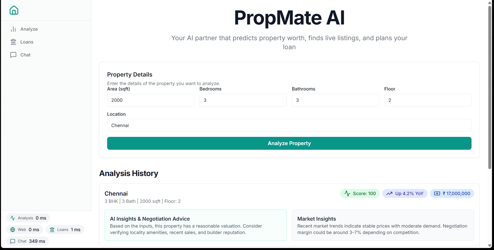

# 🚀 PropMate (AI Agent)

🎥 Project Demo:
https://github.com/demisewastaken/Hack/

# 🏡 Propmate – Smart Real Estate Analysis Platform

> Empowering property seekers with intelligent, data-driven insights.

---

## 🌐 Overview

**Propmate** is an AI-powered real estate analysis platform designed to help users find and compare properties tailored to their personal preferences — such as area, location, and number of bedrooms or bathrooms.

By aggregating data from multiple online sources, Propmate delivers accurate property recommendations, financial analysis through EMI calculation, and instant query support via an integrated chat system.

---

## 🚀 Key Features

### 🔍 Preference-Based Search  
Filter properties by key criteria — location, price, area, and amenities — to find your ideal match.

### ⚖️ Comparative Listings  
View side-by-side property comparisons for quick and informed decision-making.

### 📊 EMI Calculator  
Estimate your monthly installments with ease and discover the best available bank loan offers.

### 💬 Interactive Chat Support  
Get instant answers to property queries through our built-in chat and FAQ system.

---

## 🧠 How It Works
1. Enter your preferences (e.g., location, number of bedrooms, budget).  
2. Let **Propmate AI** fetch and analyze listings from various sources.  
3. Compare properties, calculate EMIs, and explore the best financing options.  
4. Get real-time assistance through our integrated chat module.

---

## 🏗️ Tech Highlights
- **AI-Driven Data Aggregation** for accurate property insights  
- **User-Friendly Interface** built for seamless exploration  
- **Financial Tools** for smarter investment planning  
- **Scalable Architecture** for integration with real estate agencies and AR-based tours (coming soon)

---

## 📈 Future Vision
- 🏠 Virtual & AR-based property tours  
- 🤝 Partnerships with real estate agencies for verified listings  
- 🔁 Continuous updates driven by user feedback

---

## 🤝 Contributing
We welcome contributions!  
Fork the repo, create a new branch, and submit a pull request with your improvements.

---

### 💬 Contact
📧 **Team Propmate** – dikshitghimire100@gmail.com  
🌍 [Website Coming Soon]

---

**Propmate** — *Redefining the future of real estate discovery and decision-making.*

